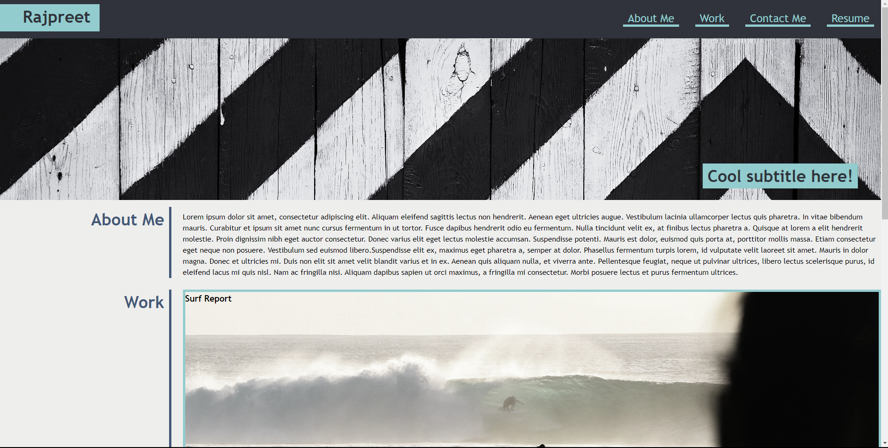

# Challenge 02: Portfolio

## Description
This is a challenge I did for my bootcamp. I was tasked to create a protfolio using HTML and CSS. In this project, I utilised the knowledge I gained over the past two weeks to help me create this portfolio landing page - Googling anything I was uncertain of.

## Screenshot

## Live
Link: https://rajpreetkr.github.io/challenge-02/test/

## License
MIT License